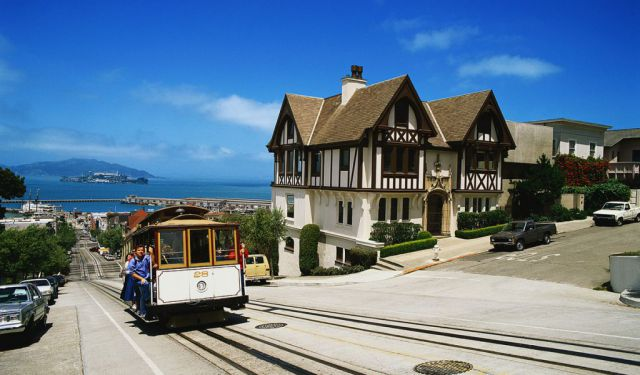

# RussianHill
Jbuilder-like views for CableReady's cable_car.  Registers a .cablecar template extension and cablecar MIME type for a dedicated view you can use to build up operations to send in a response by calling e.g. `operations.morph`




## Usage
Example code:

app/controllers/demos_controller.rb
```ruby
class DemosController < ApplicationController

  def index
    respond_to do |format|
      format.html
      format.cablecar { @message = "Hello World!"}
    end
  end

end
```

app/views/demos/index.cablecar
```
operations.morph(selector: "#message", html: @message)

operations.inner_html(selector: "#inner", html: "Hi inner!")

operations.outer_html(selector: "#outer", html: render(partial: "message", formats: :html))

```


app/views/demos/index.html.erb
```html
<div id="message"></div>

<div id="inner"></div>

<div id="outer"></div>

<script>
  window
    .mrujs
    .fetch("/cable_car_views", {headers: {"Accept": "text/vnd.cablecar.json"}})
    .then(response => response.json())
    .then(j => {
      CableReady.perform(j)
    })
</script>

```

app/views/demos/_message.html.erb
```html
Hello Partial!

<p>Here's some html</p>

<b><%= @message %></b>

```

## Installation
Add this line to your application's Gemfile:

```ruby
gem 'russian_hill'
```

And then execute:
```bash
$ bundle
```

Or install it yourself as:
```bash
$ gem install russian_hill
```

## Contributing
Contribution directions go here.

## License
The gem is available as open source under the terms of the [MIT License](https://opensource.org/licenses/MIT).
